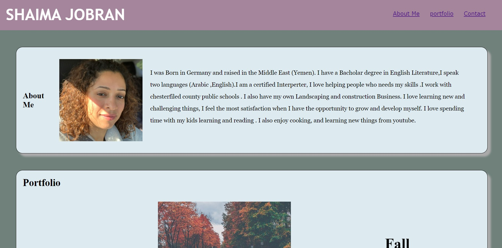
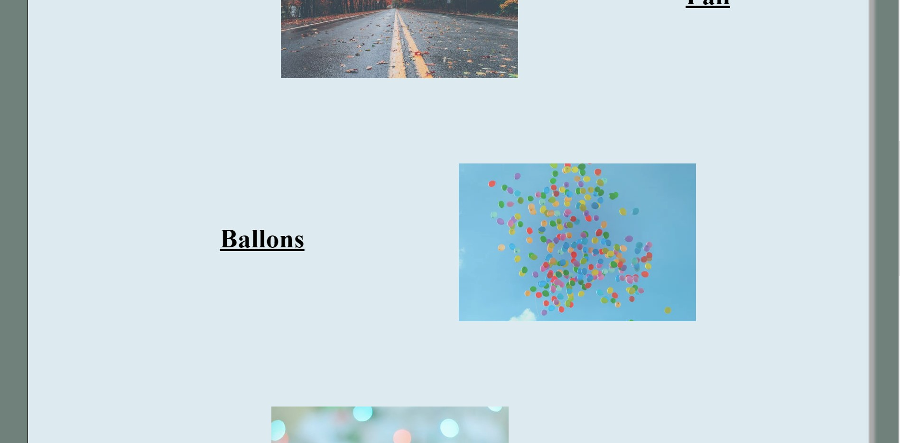
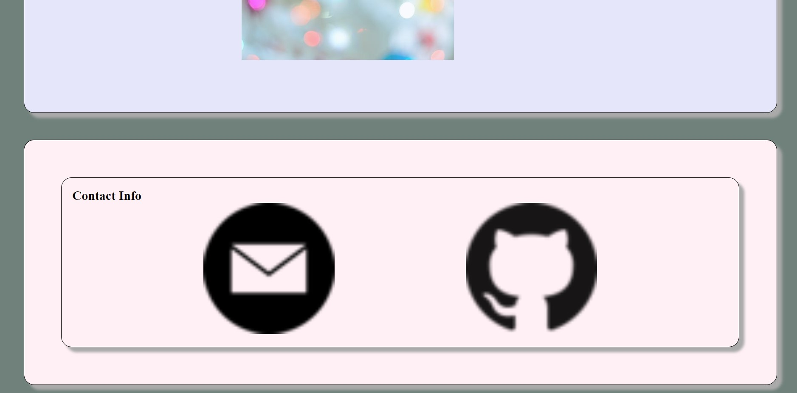

# Portfolio

## 
The application is an HTML document, styled with CSS. It contains three sections about me.

# About me 
# portfolio
# contact info
```

I can load my portfolio
I can see my name ,recent photo ,links to sections About me , portfolio , my contact info.
I can click the navigation link and UI scrolls to the section with titled images .
I pesented my first applications image and it is larger in size .
when I click on the images of the applications ,I am taken to the deployed application
I was able to resize the page and view the site on different screens and devises
The layout adapts to my viewport
```
# screenshots





# website Link
[link](https://shaimajobran.github.io/portfolio/)