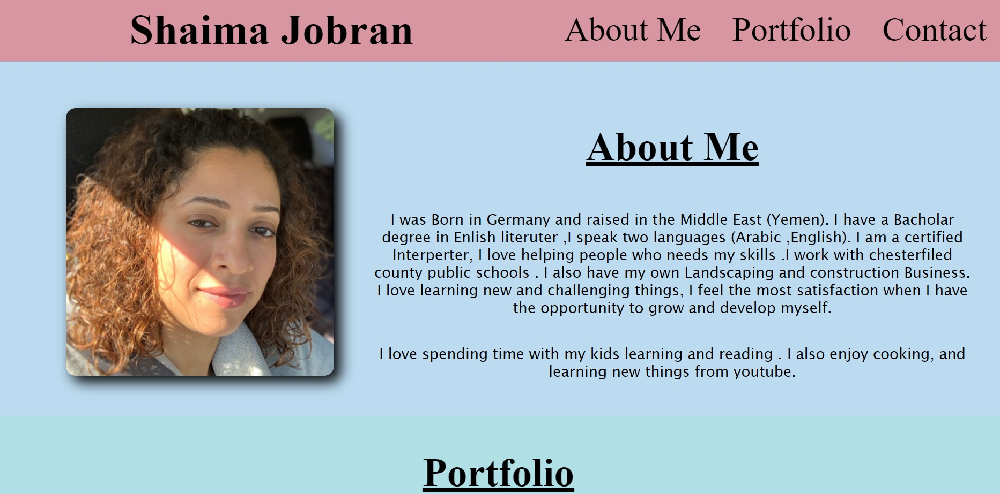
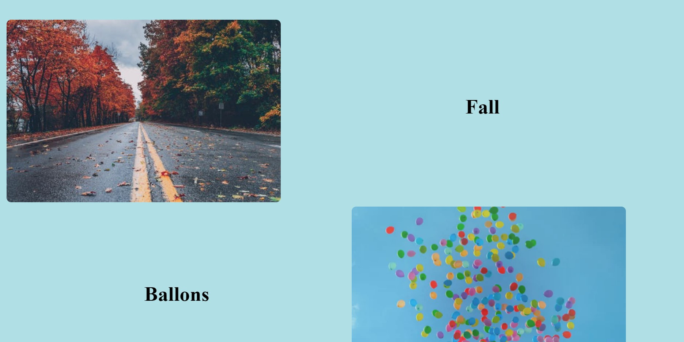
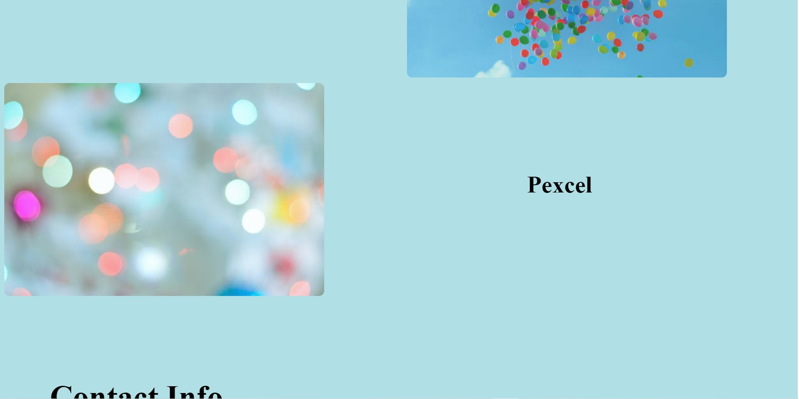
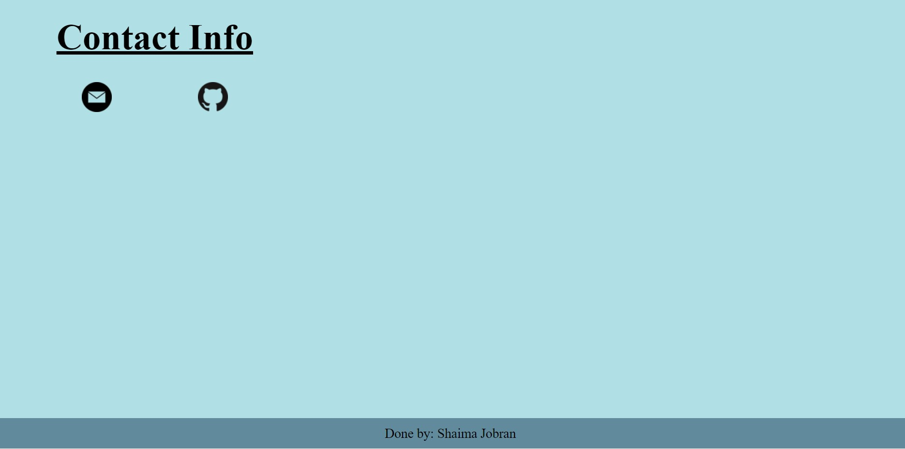

# Portfolio

## What I did 


```
I can load my portfolio
I can see my name ,recent photo ,links to sections about me , my work , my contact info
I can click the navigation link and UI scrolls to the secton with titled images 
I pesented my first applications image and it is larger in size 
when I click on the images of the applications ,I am taken to the deployed application
I was able to resize the page and view the site on variouse screes and devises
The layout adapts to my viewport
```
# screenshots






# website Link
[link](https://shaimajobran.github.io/portfolio/)